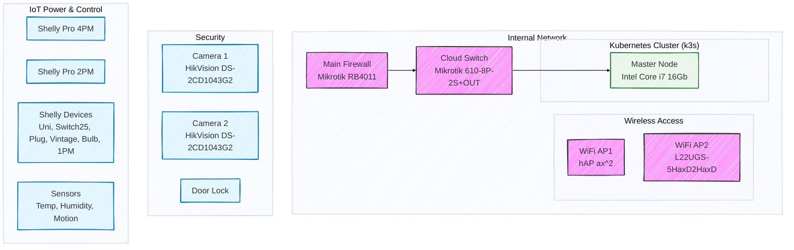

## High level diagram (data source segmentation)

### - network infrastructure with entry level information (i.e. internet connection, ip addresse, device name, etc)
### - IoT devices provide power control information, user activities, energy consumption and user real time events
### - Security device provides foto/video content, AI models metadata (human and vichle activities detection events, initial recognition of objects, and real time metadata)
### - Smart home/office datacenter provice journals and metrics data.

## Detailed schema

## Data Processing & Analytics Pipeline

We employ a hybrid data collection strategy to handle the diverse nature of our IoT and network devices, ensuring both historical depth and real-time responsiveness.

### 1. Data Collection Strategy

The system distinguishes between data that needs to be actively polled and real-time events pushed by devices.

*   **Periodic Polling (Pull):** Used for stateful information and devices without push capabilities.
    *   *Example:* Polling Mikrotik for active DHCP leases to maintain a device inventory.
*   **Event-Driven (Push):** Used for real-time telemetry and alerts.
    *   *Example:* MQTT messages from Shelly sensors (power, temperature) or HikVision camera motion alerts.

### 2. Service Integration

We are building specialized services for data ingestion and enrichment:

*   **`services/mikrotik`:** (Active) Connects to the Mikrotik REST API to fetch DHCP leases. This data is used to resolve device MAC addresses to hostnames and IP addresses, acting as the foundation for our **Device Inventory**.
*   **Future Services:**
    *   **`hik-vision`:** For retrieving camera status and snapshots.
    *   **`weather`:** External weather API integration for correlation with internal sensors.
    *   **`geoip`:** For analyzing external traffic sources.
    *   **`cloud-screenshot-analysis`:** Triggered by motion events; uploads camera snapshots to a cloud AI service for object detection/classification.

### 3. Analytics Workflow

Our data pipeline transforms raw signals into actionable insights:

1.  **Ingestion:** Data is collected via Services (API) or MQTT Brokers.
2.  **Raw Storage:** All incoming data is first saved as **Parquet** files for efficient columnar storage and history preservation.
3.  **Manual Analytics:** Data scientists/engineers can directly query Parquet files for ad-hoc analysis.
4.  **Transformation (DBT):** We use **DBT (Data Build Tool)** to define SQL models. These models clean, deduplicate, and aggregate the raw data.
    *   *Specific Use Case:* Creating the `Inventory` table by combining Mikrotik DHCP data with static device metadata.
5.  **Data Warehouse (DuckDB):** The processed models are loaded into **DuckDB** for high-performance analytical querying and dashboarding.

### 4. Architecture Diagrams

#### High-Level Data Flow

#### Detailed Processing Logic

### 5. Step-by-Step Implementation Example

This outlines the practical execution flow for our core use case—managing device inventory and collecting power metrics.

1.  **Fetch Device Data (Source):** The `mikrotik` service queries the router's DHCP server to get a list of all currently assigned IP addresses and associated MAC addresses.
2.  **Build Inventory (Transformation):** We create an `inventory` table. This is done by joining the live DHCP data with a static `device_metadata.csv` seed file (containing owner, location, device type). This gives us a trusted list of *what* is on the network.
3.  **Targeted Polling (Enrichment):** The system uses the `inventory` table to identify active Shelly devices. It then specifically polls these IP addresses to get detailed status (power usage, temperature, relay state).
4.  **Persist Data (Storage):** The results of these polls are immediately written to local disk as time-partitioned **Parquet** files (e.g., `data/shelly_raw.parquet`).
5.  **Analytics (Aggregation):** Finally, DBT runs scheduled transformations to read the Parquet files, aggregate the metrics (e.g., "Daily Power Consumption by Room"), and load the clean results into **DuckDB** for visualization.